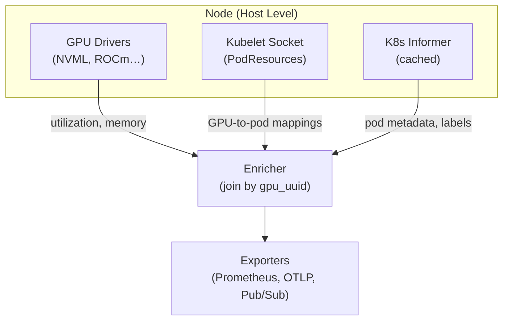

# gpusprint

`gpusprint` is a highly lightweight (using <128MB RAM and negligible CPU), single-binary Kubernetes DaemonSet written in Go that tracks GPU utilization, allocation, and efficiency across your clusters. It works with multiple accelerators and provides unified metrics regardless of the underlying hardware.

Metrics are exported in fully open formats (Prometheus/OTLP), so you can build any custom dashboard. Alternatively, you can use the application to create more beautiful, customizable, and dynamic charts. An example is available here: [GPUSprint](https://gpusprint.com/).

| Accelerator | Status |
|---|---|
| NVIDIA (NVML) | ✅ Supported |
| AMD (ROCm) | Planned |
| Google TPUs | Planned |
| Tenstorrent | Planned |
| AWS Trainium / Inferentia | Planned |
| Intel | Planned |

| Exporter | Type | Status |
|---|---|---|
| Prometheus | Pull (`:9400/metrics`) | ✅ Supported |
| OpenTelemetry (OTLP) | Push (gRPC & HTTP) | ✅ Supported |
| Google Cloud Pub/Sub | Push | ✅ Supported |

## Why

GPU utilization = the number of experiments per dollar. Usually, ML teams rely on `dcgm-exporter` (host), `kube-state-metrics` (cluster), and application metrics - three sources that break down across vendors, produce high cardinalities, and create data gaps.

`gpusprint` solves this by collecting everything locally on each node. It gives you unified metrics across all your accelerators (NVIDIA, AMD, Tenstorrent, TPUs, etc.) in a single, consistent format without stitching together multiple tools.

## How It Works



1. **Hardware Telemetry** - Reads utilization, memory usage directly from GPU drivers.
2. **Kubelet Allocation Mapping** - Reads the local `PodResources` gRPC socket to map GPUs -> pods.
3. **Metadata Enrichment** - Appends workload context (`Deployment`, `Job`) and custom pod labels (`team`, `owner`) from a cached K8s informer.

## Metrics

*Note: These metrics are currently a draft and might change as the project evolves.*

gpusprint uses a **two-layer design** to keep aggregations correct even when GPUs are shared across pods.

### Hardware Metrics (one row per physical GPU)

| Metric | Type | Description |
|---|---|---|
| `gpusprint_utilization_percent` | Gauge | SM / compute-unit utilization |
| `gpusprint_memory_used_bytes` | Gauge | VRAM currently consumed |
| `gpusprint_memory_total_bytes` | Gauge | Total VRAM on device |

**Labels:** `cluster`, `node`, `uuid`, `vendor`, `model`

### Allocation Info (one row per GPU -> pod binding)

| Metric | Type | Description |
|---|---|---|
| `gpusprint_allocation_info` | Gauge (1) | GPU-to-pod mapping. Join on `uuid`. |

**Labels:** `uuid`, `pod_namespace`, `pod_name`, `container_name`, `workload_kind`, `workload_name`, `team`, `owner`

Unallocated GPUs have hardware rows but no `gpusprint_allocation_info` row.

## Deployment

Install on any Kubernetes cluster with Helm:

```bash
helm upgrade --install gpusprint oci://ghcr.io/antonibertel/charts/gpusprint \
  --namespace gpusprint-system --create-namespace
```

### Prerequisites

- A Kubernetes cluster with GPU nodes
- Basic accelerator drivers installed on the host (e.g., NVIDIA drivers)
- **Pod Labels**: To correctly aggregate metrics and attribute GPU usage, your pods must be tagged with specific labels (by default, it looks for `team` and `owner`). These keys tell `gpusprint` how to slice the data and can be customized via the `TEAM_LABEL_KEY` and `OWNER_LABEL_KEY` environment variables.
- **Cluster Name**: You should configure the `CLUSTER_NAME` environment variable on the DaemonSet to identify where the metrics are originating from.

### Configuration

All configuration via environment variables (12-factor):

| Env Var | Default | Description |
|---|---|---|
| `NODE_NAME` | *(required)* | Set via `fieldRef: spec.nodeName` |
| `CLUSTER_NAME` | `""` | Cluster identifier for multi-cluster setups |
| `SAMPLE_INTERVAL` | `10s` | How often to collect metrics |
| `KUBELET_SOCKET` | `/var/lib/kubelet/pod-resources/kubelet.sock` | PodResources gRPC socket |
| `TEAM_LABEL_KEY` | `team` | Pod label key for team attribution |
| `OWNER_LABEL_KEY` | `owner` | Pod label key for individual attribution |
| `PROMETHEUS_ENABLED` | `true` | Expose `:9400/metrics` endpoint |
| `PROMETHEUS_ADDR` | `:9400` | Prometheus listen address |
| `OTLP_ENABLED` | `false` | Push to OTLP collector |
| `OTLP_ENDPOINT` | - | OTLP collector endpoint |
| `OTLP_PROTOCOL` | `grpc` | `grpc` or `http/protobuf` |
| `PUBSUB_ENABLED` | `false` | Push to Google Cloud Pub/Sub |
| `PUBSUB_PROJECT` | - | GCP project ID |
| `PUBSUB_HARDWARE_TOPIC` | - | Pub/Sub topic for hardware telemetry |
| `PUBSUB_ALLOCATION_TOPIC` | - | Pub/Sub topic for allocation metadata |
| `LOG_LEVEL` | `info` | `debug`, `info`, `warn`, `error` |
| `LOG_FORMAT` | `json` | `json` or `text` |
| `DEVELOPMENT_MODE` | `false` | Use simulated GPU/kubelet data (for testing) |

### Local Development (Minikube)

```bash
# Start minikube
./local-testing/start-minikube.sh

# Deploy with production images
./local-testing/deploy.sh

# Or build & deploy local images
USE_LOCAL=1 ./local-testing/deploy.sh

# Check metrics
kubectl -n gpusprint-system port-forward daemonset/gpusprint 9400:9400
curl http://localhost:9400/metrics
```
